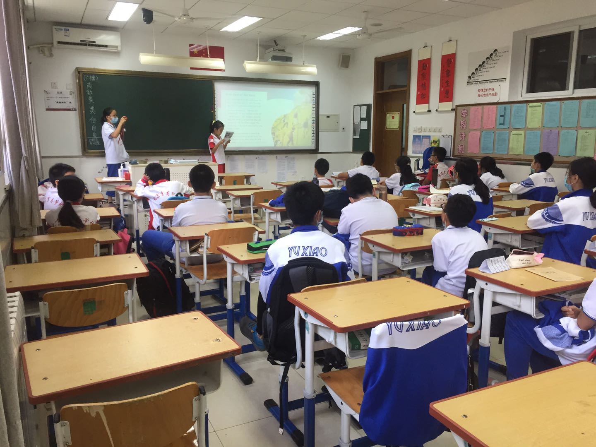
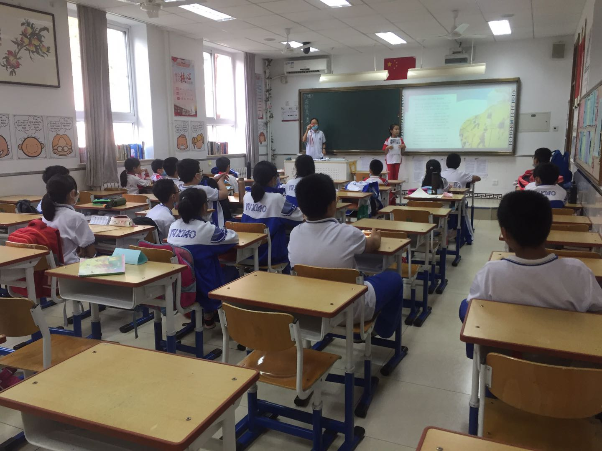
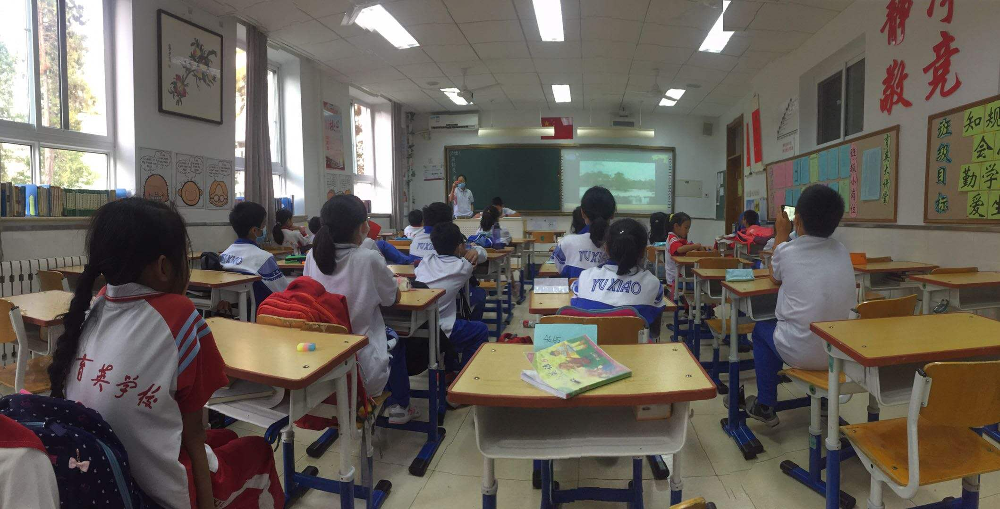
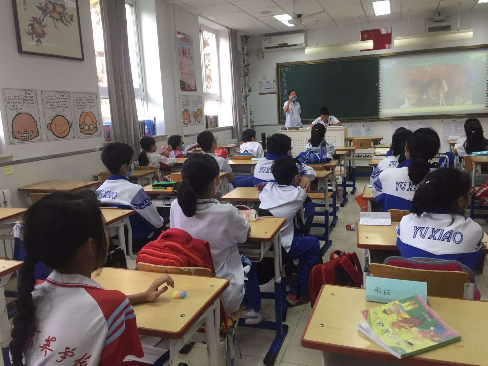

<!--
 * @Author: Hiseh
 * @Date: 2020-09-26 22:04:45
 * @LastEditors: Hiseh
 * @LastEditTime: 2020-09-26 22:17:36
 * @Description: 
-->

# 英语原版阅读社团通讯稿 2020-09-25

金秋时分，我们迎来20年第一次社团活动。我们一起阅读好书，分享有价值的好故事。同学们都能按时参加活动，遵守社团纪律，不迟到，不早退，有事提前群内请假。活动中注意自己的修养，不打断老师、同学发言，不随意离开座位走动，不在教室里追跑打闹。爱护教室内设施，不随意翻动他人物品维护教室卫生，走之前桌椅摆放整齐。

## 《Aesop's Fables》

## 《Journey To West》

## 《You Speak English》

## 《Harry Potter》

