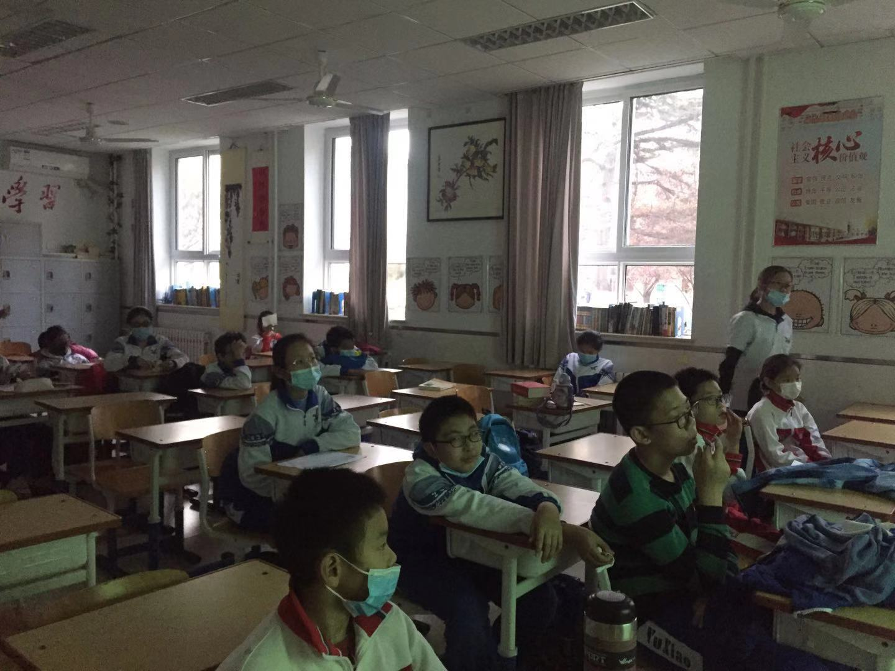
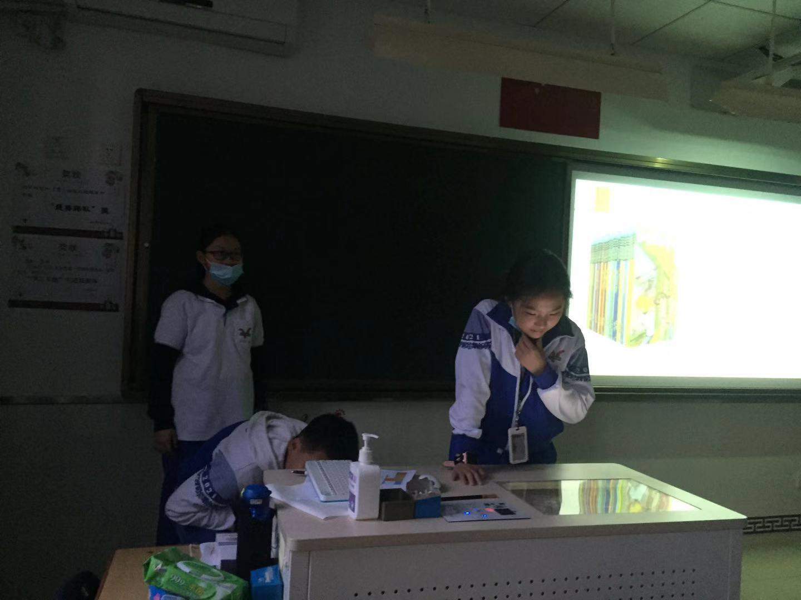
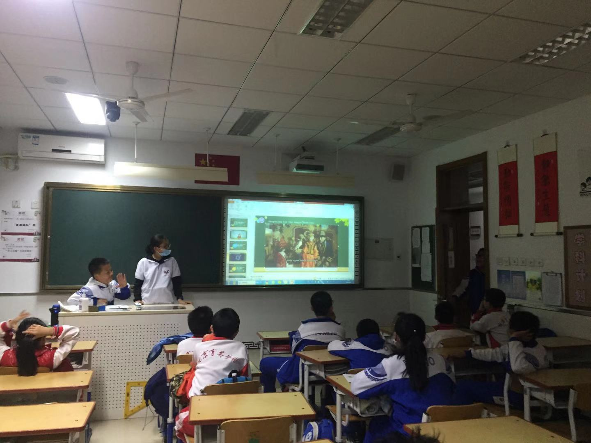
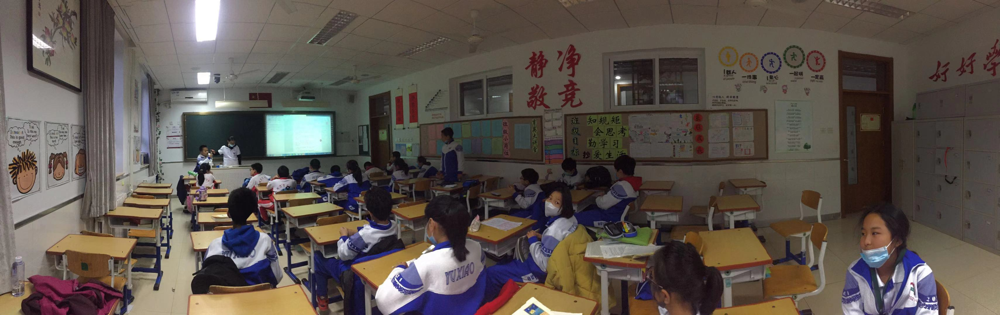

<!--
 * @Author: Hiseh
 * @Date: 2020-11-21 19:03:54
 * @LastEditors: Hiseh
 * @LastEditTime: 2020-11-21 23:30:35
 * @Description: 
-->

# 英语原版阅读社团通讯稿 2020-11-20

11月20日，英语原版阅读社团开展了本学期第六次社团活动。
在今天的《每周好书分享》活动中，这次由四位同学分享了好书。

同学们抓住学习交流机会，精彩的故事情节吸引了大家，个个听得聚精会神。

## 杨紫汇在分享

## 魏铭萱在讲解

虽然社团活动时间很短，但是“小老师”们认真充分准备，带着大家一起分享原版好书，开拓视野，提升了我们学习英语的兴趣。期待在期精彩活动吧～

