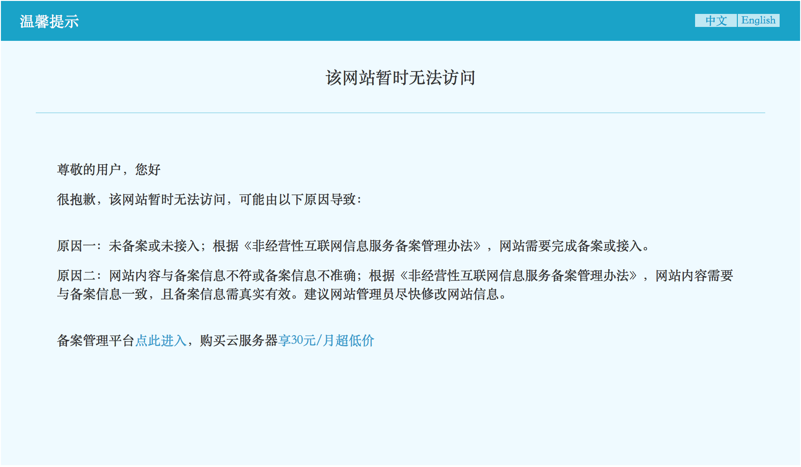
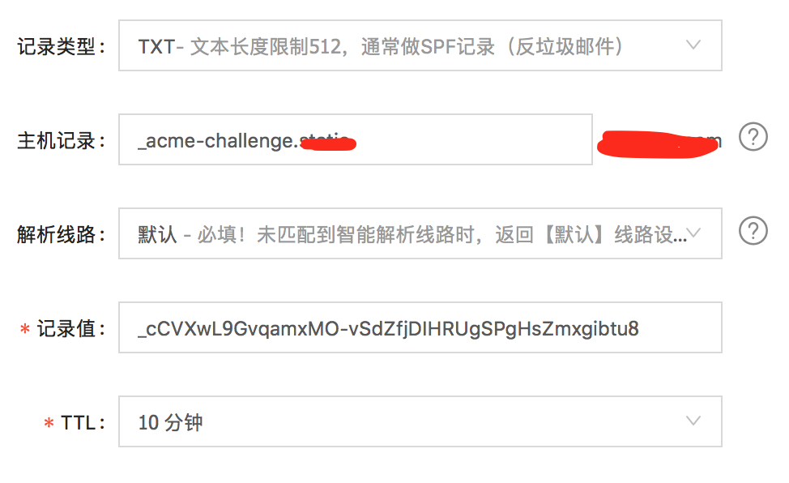

# 如何在未备案的网站上部署免费证书
## 选择证书颁发机构
随着人们安全意识提高，网站已经进入https时代，本文不再赘述https的必要性，仅描述如何部署。

对于不差钱的公司，当然是购买证书省心省力，这类证书一般都是按年付费，价格不菲。对于个人开发者和创业团队，则没必要在这上面投入太多资金，首先考虑免费证书。国内有很多免费证书机构，但约束条件都很多，比如阿里只对第一次注册的用户免费使用3个月，腾讯证书只能部署在腾讯云上，而且国内网站都施行审核制，需要书面申请才给颁发证书，操作起来很麻烦。这里我推荐[Let’s Encrypt](https://letsencrypt.org)家证书。Let's Encrypt采用运用*ACME*协议自动签发、自动续期，申请时，不需要提前准备资料，不需要书面申请。唯一一点注意事项就是Let’s Encrypt规定了每次签发的证书有效期只有三个月，证书生成一个月之后可以免费重签/续期。
## 域名验证方式
申请Let's Encrypt证书时，需要证明域名的确归你所有，有两种方式：

- URL验证：Let's Encrypt生成一个随机内容的文件，我们只要把这个文件放在指定位置，要用待绑定的域名 + path可以访问到这个文件，即可通过验证。
- DNS检验：Let's Encrypt生成一个随机字符串，我们把这个字符串添加为待绑定域名某个name的txt值，只要能通过公网上的DNS服务器解析到这个字符串，即可通过验证。

从上面两种方式来看，当然URL验证更直观，易操作。但在国内，第一种方式只适用于已备案的网站，因为国内要求网站都必须先备案再发布。以阿里云为例，如果网站未备案或备案中，那网站的80口会被阿里劫持，将返回内容篡改成一个title为“TestPage”的提示页面：

因此未备案的网站只能选择DNS检验方式。
## 申请证书
说了半天，总算要步入正题了，在具体操作之前，介绍两种申请方式：

0. 通过Let's Encrypt官方推荐的cerbot(https://github.com/certbot/certbot)客户端申请。
0. 通过第三方封装的Python脚本申请
### 使用cerbot申请
0. 请确认已安装git
0. 申请证书
```bash
git clone https://github.com/certbot/certbot
cd certbot
./certbot-auto --manual --preferred-challenges dns --expand --renew-by-default  --manual-public-ip-logging-ok certonly --text --agree-tos --email <验证用的email> -d <域名1> -d <域名2> ...
```
### 使用Python脚本申请
强烈推荐通过Python脚本申请，这种方式更方便，成功率更高。

0. 请确认已安装Python 2.6+
0. 安装Python脚本
```bash
pip install --upgrade certbot
```
2. 申请证书
```bash
certbot --manual --preferred-challenges dns --expand --renew-by-default  --manual-public-ip-logging-ok certonly --text --agree-tos --email <验证用的email> -d <域名1> -d <域名2>
```

### 验证域名
运行后，会给以下提示
```bash
Please deploy a DNS TXT record under the name
_acme-challenge.<要申请的域名> with the following value:

667drNmQL3vX6bu8YZlgy0wKNBlCny8yrjF1lSaUndc

Once this is deployed,
Press ENTER to continue
```
这里以阿里云DNS为例，讲解如何实现DNS验证。

0. 点击**添加记录**

0. 保存后等上半分钟，然后执行
```bash
dig -t txt _acme-challenge.<要申请的域名>
```
如果在```ANSWER SECTION```中能看到记录值，说明DNS生效了，否则等会再试。

2. DNS生效后，按回车继续。

流程走完后，在```/etc/letsencrypt/live/<your.domain.com>```下可以看到以下几个文件:

- **privkey.pem** 私钥；
- **fullchain.pem** 带完整认证链的证书。注意，说是fullchain，其实CA是Let's Encrypt自家的CA，在某些老的操作浏览器上仍然有bug；
- **chain.pem** README，上面说法是给nginx stapling用的，其实里面就是CA的证书；
- **cert.pem** 公钥。

## 部署证书
以Nginx为例，配置如下：
```nginx
#打开SSL
ssl on;
#证书位置
ssl_certificate /etc/letsencrypt/live/www.ebizyun.com/fullchain.pem;
#私钥位置
ssl_certificate_key /etc/letsencrypt/live/www.ebizyun.com/privkey.pem; 
#域名证书与ROOT证书之间的认证链，这是CA之间经常使用的一种提高自身兼容性的办法。
ssl_trusted_certificate /www/letsencrypt_full_chained.pem;
#在DHE密钥交换的时候使用的密钥
ssl_dhparam /www/dhparam.pem;

ssl_stapling on;
ssl_stapling_verify on;
ssl_session_timeout 5m;
ssl_protocols TLSv1 TLSv1.1 TLSv1.2;
ssl_ciphers ALL:!DH:!EXPORT:!RC4:+HIGH:+MEDIUM:-LOW:!aNULL:!eNULL;
ssl_prefer_server_ciphers  on;
ssl_session_cache shared:SSL:50m;
```
### 生成ssl_trusted_certificate证书的简单方法
```bash
curl -Lo "${HOME}/lets-encrypt-x3-cross-signed.pem"  "https://letsencrypt.org/certs/lets-encrypt-x3-cross-signed.pem"
curl -Lo "${HOME}/isrgrootx1.pem" "https://letsencrypt.org/certs/isrgrootx1.pem"
sed -i 's@\s*$@@g' "${HOME}/isrgrootx1.pem"
cat ${HOME}/lets-encrypt-x3-cross-signed.pem ${HOME}/isrgrootx1.pem > letsencrypt_full_chained.pem
```
上面的命令原理是假设certbot生成的fullchain.pem里面有以下的规则。

0. 证书都是由letsencrypt CA直接认证的，没有中间的颁发者。
0. 签发证书的letsencrypt CA是lets-encrypt-x3。

所以，当上面的配置出现错误时，最简单的办法是注掉```ssl_trusted_certificate```这行。
### ssl_dhparam密钥
```bash
openssl dhparam -out dhparam.pem 2048
```
因为服务器性能一般，选择了2048位密钥，从安全角度，建议用4096位。

# 自动续期
虽然Let's Encrypt的证书有效期是三个月，但官方建议一天延期两次，原话是这样的：
>Note:
>
>if you're setting up a cron or systemd job, we recommend running it twice per day (it won't do anything until your certificates are due for renewal or revoked, but running it regularly would give your site a chance of staying online in case a Let's Encrypt-initiated revocation happened for some reason). Please select a random minute within the hour for your renewal tasks.

因为如果设定为90天，万一哪天你重启服务器，crontab没有及时执行，证书会过期。不过从我实际使用上来看，重启服务器是小概率事件，没必要这么频繁地申请延期。设定为5~30天一次就行了。
```bash
0 2 1 * * certbot renew --quiet --renew-hook "nginx -s reload" 
```