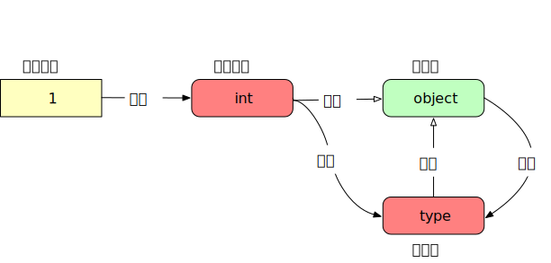
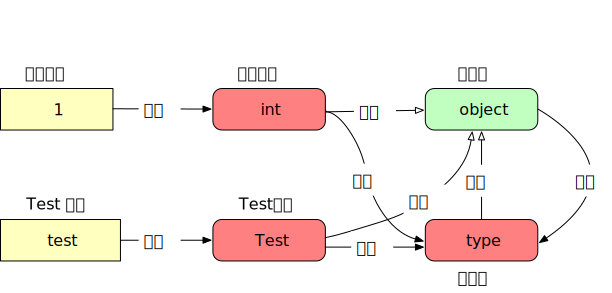

<!--
 * @Author: Hiseh
 * @Date: 2020-08-14 16:22:45
 * @LastEditors: Hiseh
 * @LastEditTime: 2020-08-22 09:57:03
 * @Description: 源码
-->

# Python对象初探

0. Python对象初探
0. [Python对象的本质](./pyobject2.md)
0. [Python对象生命周期](./pyobject3.md)

====================================================

最近几个同事在学python，学习时总弄混python中对象和引用的关系，也不太理解为什么python一切都是对象。网上的资料常流于表面，看完还是一知半解的，因此我结合自己学习的过程，整理了此篇文章，希望能帮助初学者了解python一些基本理念。

## 对象、类型的概念

对象是Python最核心的概念，在Python中，一切皆是对象。Python没有像很多OO语言一样，为了效率而引入基础类型概念，Python里一个数字，一个字符，甚至整数这个“类型”都是对象，这里非常容易混淆初学者，多数文章都是知其然不知其所以然。下面我用代码由浅入深讲解对象和类型的概念：

```py
>>> type(int(1))
<class 'int'>
>>> isinstance(int(1), int)
True
```

上面代码很容易理解，`1`是`int`对象，其类型是`int`类型。那么`int`类型又是什么呢？

```py
>>> type(int)
<class 'type'>
>>> isinstance(int, type)
True
>>> issubclass(int, object)
True
>>> issubclass(type, object)
True
>>> type(object)
<class 'type'>
```

原来`int`类型是`type`对象，`int`本身继承自`object`。`type`也是个类，它的父类是`object`，`object`也有类型，它的类型是`type`……到此为止，我们知道对象和类型有这么一个关系：



`int`是Python内置类型，那么自定义类型又是什么关系呢，依然用代码演示。

```py
>>> class Test:
...     def func(self):
...             print('test')
...
>>> test = Test()
>>> type(test)
<class '__main__.Test'>
>>> type(Test)
<class 'type'>
>>> isinstance(Test, object)
True
>>> issubclass(Test, object)
True
```

可以看出自定义类型也是`type`，默认父类是`object`（如果显示继承，父类就是指定的类）。所以完善后的对象和类型关系如下：



现在我们明白了，所有的类型都继承自`object`，所有类型的类型都是`type`，但`type`的类型又是什么呢？

```py
>>> type(type)
<class 'type'>
```

原来`type`的类型也是`type`，最终对象和类型的关系应该是：


## 变量和对象的关系

对于大多数语言，变量要么在栈里直接存储变量值，要么在堆中申请块内存，用指针操作，总之两个值相同的变量仅仅是内容相同，操作时完全可以当两个独立的实体操作。但Python里的变量可不是这个样的，首先须清楚可变对象与不可变对象。不可变对象变量却只是指针，而内容是**实例化**的对象，变量指向该对象。因此多个值相同的变量，它们仅仅是多个名字不一样的指针，指向了同一块内存地址。

```py
>>> a = 1
>>> b = 1
>>> c = a
>>> assert id(a) == id(b) == id(c)
```

看到了吧，值一样的不可变对象，它们不会被重复创建，所有对应的变量都指向一个地址。

```py
>>> a = 1
>>> b = a
>>> assert id(a) == id(b)
>>> a += 1
>>> assert id(a) != id(b)
```

这里`a`的值变了，`a`的地址也变了，但`b`的地址却没变，这又是为什么呢？因为`int`是不可变对象，所谓**不可变**，指的是在对象创建后的整个生命周期，其值都不可修改。上面`a += 1`，并不是修改了`a`的值，而是Python用新数值创建一个**新对象**，`a`与**新对象**进行绑定，同时检查旧对象是否还被引用，如果没有则释放。这也是Python用空间换时间的策略，即每次修改整数对象都要创建新对象、回收旧对象。

可变对象概念与其他语言堆中创建的对象类似，可以修改对象内容，此时不改变对象地址。

```py
>>> l = list()
>>> id(l)
4500446736
>>> l.append(1)
>>> id(l)
4500446736
>>>
>>> l2 = l
>>> l.append(2)
>>> l
[1, 2]
>>> l2
[1, 2]
```

看到这，算是明白Python变量、对象和类型的概念了，但这些东西在内存里实际是什么样的，我们还需要进一步分析。

[Python对象的本质  >>>](./pyobject2.md)
