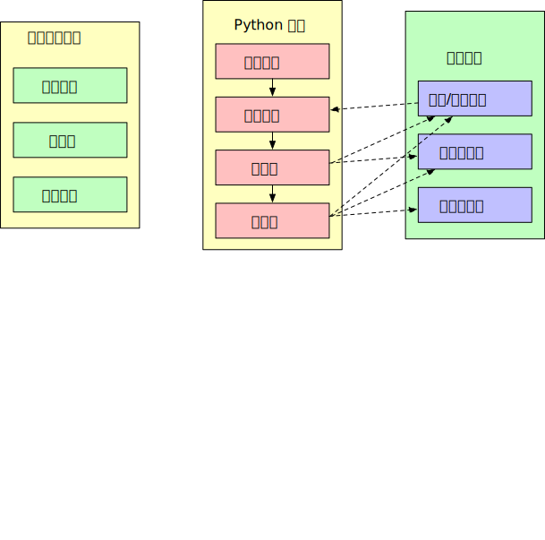
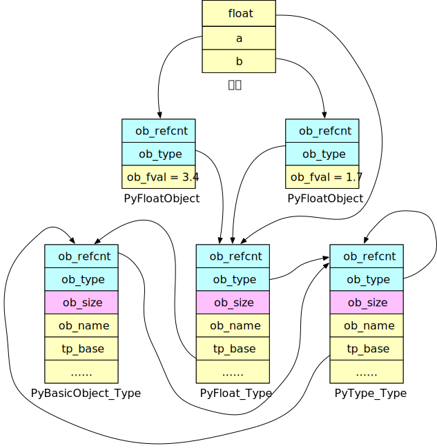

<!--
 * @Author: Hiseh
 * @Date: 2020-08-15 11:06:24
 * @LastEditors: Hiseh
 * @LastEditTime: 2020-08-22 16:03:56
 * @Description: 
-->

# Python对象的本质

0. [Python对象初探](./pyobject.md)
0. Python对象的本质
0. [Python对象生命周期](./pyobject3.md)

====================================================

为了进一步了解Python中对象概念，我们应该看看Python源码，下面我会用`Python 3.7.4`举例子说明，使用`Python 2`的读者请注意，2和3差别还是很大的。

## Python总体架构



如图所示，Python总体架构可分为三部分，左边是Python自带的各种模块（Core Modules）、库（Library）以及用户自定义模块（User-defined Modules）。最右边是Python运行时环境，包括对象/类型系统（Object/Type Structures），内存分配器（Memory Allocator）和运行时状态（Current State of Python）。运行时状态维护了解释器在执行字节码时不同状态之间的切换动作，可以简单理解为大个有穷状态机。内存分配器负责创建和销毁对象时内存的分配及回收动作。**对象/类型系统负责管理Python各种对象和类型体系，是本文重点关注部分。**
<br/>
中间为Python核心，箭头是Python运行时的数据流方向。词法分析（Scanner）负责把源码切分成一个个token，语法分析（Parser）负责建立抽象语法树（AST），编译器（Compiler）负责生成字节码，最后由虚拟机（Code Evaluator）来执行字节码。核心和运行环境之间的虚线表示模块之间**调用和修改**关系。

## Python源码关系

以3.7.4版本源码为例，我们常用的目录结构如下：


-  **Doc** 和 **Grammar** 包含各种文档文件。
- **include** 包含所有C头文件，如果我们要编译自定义模块扩展Python，需要用到这里的文件。
- **Lib** 包含所有Python语言编写的标准库。
- **Modules** 包含所有C语言编写的标准库。通常对速度要求高的库用C写，在Modules下；对速度不敏感的用Python写，在Lib下。
- **Parser** 包含Python核心的词法和语法分析部分，此外还包含语法分析工具，方便我们调试Python环境。
- **Python** 包含Python核心的编译器及虚拟机部分。
- **PCBuild** 包含VS的工程文件。
- **Mac** 包含Mac环境编译设置文件（Makefile格式）
- **Object** 包含所有Python内置对象，本文仅仅关注此模块内容。

Python源码仅提供Visual Studio和Makefile格式的工程文件，习惯CMake的用户可以找第三方Makefile转CMake工具转换成CMake项目。

## Python一切对象的根基——PyObject

常见的面向对象语言都有**类**和**对象**两个概念，但Python里概念不太一样。在Python里，`class`也是一种对象，它们通常被称为**类型对象**（`type`），`class`实例化的产出物也叫对象，我们称为**实例对象**（`object`）。上页我们还介绍了可变对象和不可变对象，在Python中还有定长对象和不定长对象概念，它们之间区别如下：
|类别|定义|
|:--:|:--|
|可变对象|对象创建后可以修改，修改不会改变对象地址|
|不可变对象|对象创建后不能修改，修改会创建新对象|
|定长对象|对象内存大小固定，根类是PyObject|
|不定长对象|对象大小不固定，根类是PyVarObject|

*include/object.h*文件定义了Python根对象结构体:

```c
typedef struct _object {
    _PyObject_HEAD_EXTRA
    Py_ssize_t ob_refcnt;
    struct _typeobject *ob_type;
} PyObject;

typedef struct {
    PyObject ob_base;
    Py_ssize_t ob_size;
} PyVarObject;
```

从代码里可以看到，`PyVarObject`为不定长对象的根，`PyObject`是定长对象和`PyVarObject`的根。

首先看看`PyObject`，结构体第一行是个宏`_PyObject_HEAD_EXTRA`，这个宏定义也在*object.h*里：

```c
// 这个宏仅仅用来跟踪Python调用过程时，增加个双向链表，正常编译会略过。
#ifdef Py_TRACE_REFS
#define _PyObject_HEAD_EXTRA            \
    struct _object *_ob_next;           \
    struct _object *_ob_prev;

#define _PyObject_EXTRA_INIT 0, 0,

#else
#define _PyObject_HEAD_EXTRA
#define _PyObject_EXTRA_INIT
#endif
```

第二行定了一个引用计数变量`ob_refcnt`，`Py_ssize_t`就是`intptr_t`的别名，可以简单理解成有符号的`size_t`。第三行定义了类型指针`ob_type`，指向对象的类型对象。

接着看`PyVarObject`，它在`PyObject`基础上增加了`ob_size`字段，用来记录元素个数。

为了方便引用，*object.h*还定义了两个宏，方便其它对象引用。

```c
#define PyObject_HEAD       PyObject ob_base;
#define PyObject_VAR_HEAD   PyVarObject ob_base;
```

比如定长对象`PyFloatObject`，只需要在`PyObject`基础上加个`double`值变量：

```c
typedef struct {
    PyObject_HEAD
    double ob_fval;  //存储对象值
} PyFloatObject
```

而变长对象`PyListObject`，则在`PyVarObject`基础上增加两个变量，一个动态数组总长度，一个为数组指针。

```c
typedef struct {
    PyObject_VAR_HEAD
    PyObject **ob_item;     //数组指针，数组里保存元素指针。
    Py_ssize_t allocated;   //数组长度，注意与PyVarObject中定义的ob_size元素个数区别。
} PyListObject;
```

> 这里特别解释一下`int`对象类型，*Python 2*里`int`是定长对象（`PyIntObject`），但到了*Python 3*，则去掉`PyIntObject`对象，改为`PyLongObject`，是变长对象。`PyLongObject`里用一个`ob_digit`数组管理整数，最后整数对象的值是`SUM(for i=0 through abs(ob_size)-1) ob_digit[i] * 2**(SHIFT*i)`，其中`SHIFT`表示每个数字占有的位数。
> <br/>为了证明整数是变长对象，可以用代码验证
>
> ```py
> >>> sys.getsizeof(1000000000)
> 28
> >>> sys.getsizeof(10000000000)
> 32
> ```

### 初始化对象

*object.h*中有两个初始化对象的宏也重要

```c
#define PyObject_HEAD_INIT(type)        \
    { _PyObject_EXTRA_INIT              \
    1, type },
```

从名字就能看出来`PyObject_HEAD_INIT`负责初始化定长对象，它会把引用计数（`ob_refcnt`）设为1（因为Python里`ob_refcnt == 0`就会触发回收机制），同时设定对象的传入类型。`_PyObject_EXTRA_INIT`也是个宏，就是个标记位，在调试时用。

```c
#define PyVarObject_HEAD_INIT(type, size)       \
    { PyObject_HEAD_INIT(type) size },
```

`PyVarObject_HEAD_INIT`负责初始化不定长对象，它除了调用`PyObject_HEAD_INIT`部分外，还会设定`ob_size`元素。

看完`PyObject`源码，我们发现所有Python对象，内存开始的几个字节内容都是统一的，对象开头是引用计数和类型指针，变长对象还包括元素个数。这么设计当然是方便实现继承了，但系统无法凭这几个字节区分出不同的对象类型，怎么判断它们所支持的操作呢，而且上面初始化过程也没看到分配内存的步骤，凭常识也能知道初始化不会这么简单。

## PyTypeObject 对象的元信息

上一页我们了解过类型对象，知道**类型对象负责维护对象的特定信息，比如内存分配，特定的操作方法**。前一节也说了`PyObject`结构体第三行定义了类型指针`ob_type`，指向对象的类型对象，现在我们就看一下这个类型对象。

`PyTypeObject`也在*object.h*中定义，这个结构体比较长，只摘出我们关心的代码分析：

```c
typedef struct _typeobject {
    PyObject_VAR_HEAD
    const char *tp_name;                    // 类型名称
    Py_ssize_t tp_basicsize, tp_itemsize;   // 创建实例时所需的内存信息

    // 标准函数指针
    destructor tp_dealloc;
    printfunc tp_print;
    getattrfunc tp_getattr;
    setattrfunc tp_setattr;
    hashfunc tp_hash;
    ternaryfunc tp_call;
    reprfunc tp_str;
    getattrofunc tp_getattro;
    setattrofunc tp_setattro;

    struct _typeobject *tp_base;            // 父类对象指针
} PyTypeObject;
```

从代码里很清楚地看到所有我们熟悉的面向对象信息都由`PyTypeObject`管理，包括：类型信息（`tp_name`）、继承信息（`tp_base`）、内存信息（`tp_basicsize`，`tp_itemsize`）,对象操作信息（`tp_print`，`tp_hash`……）。这个类型对象是不是很像面向对象里的**类**啊？

我们看下浮点数类型对象`PyFloat_Type`，它是`PyTypeObject`的实例，在*Objects/floatobject.c*中定义，这个定义也很长，我们只看关键部分：

```c
PyTypeObject PyFloat_Type = {
    PyVarObject_HEAD_INIT(&PyType_Type, 0)  // 初始化PyVarObject内容。
    "float",                                // 类型名为float。
    sizeof(PyFloatObject),                  // 设定tp_basicsize
    0,                                      // 设定tp_itemsize
    (destructor)float_dealloc,              // 各种函数指针
    0,                                      // 父类对象指针
};
```

到这里，我们可以梳理下Python中变量、对象和类型的拓扑关系了：


`a`和`b`都是`PyFloatObject`结构体的实例，在`ob_fval`里保存了对应的数值。*类型对象*是一个`PyTypeObject`结构体，保存了类型名、内存分配信息以及浮点相关操作。类型对象指针`ob_type`指向类型对象，Python据此判断对象类型，进而获悉关于对象的元信息，如操作方法等。

由此可见**float、a以及b等变量都是指向实际对象的指针**。

### PyType_Type类型的类型

上面`PyFloatObject`第一行初始化`PyVarObject`的代码，传入了`PyType_Type`地址，`PyType_Type`又是什么？第一页[Python对象初探](./pyobject.md)里，我们知道`int`的类型是`type`对象，那么`type`的类型又是什么呢？

```py
>>> type(type)
<class 'type'>
```

`type`的类型还是`type`，到这我们很好奇这个`type`具体长啥样呢？它在*Objects/typeobject.c*里有定义，就像`PyFloat_Type`，它也是`PyTypeobject`的实例，同样代码很长，我们只看关键部分：

```c
PyTypeObject PyType_Type = {
    PyVarObject_HEAD_INIT(&PyType_Type, 0)  // 初始化PyVarObject内容。
    "type",                                 // 类型名为type。
    sizeof(PyHeapTypeObject),               // 设定tp_basicsize
    sizeof(PyMemberDef),                    // 设定tp_itemsize
    (destructor)type_dealloc                // 各种函数指针
};

```

看初始化`PyVarObject_HEAD_INIT`的参数，它把自己（`&PyType_Type`）传给`ob_type`，这下就明白了为什么Python中看到`type`的类型还是`type`。`type`看上去就是个普通的`PyTypeObject`实例，但它就像`PyObject`一样，是所有类型的根类型，我们一般叫它**元类型（meta class）**

上面拓扑图里加上`type`类型对象后如下：


我们回头再看`PyFloat_Type`实例代码，`tp_base`是**0**？！难道初始化时不需要初始化父类吗？肯定不符合面向对象的约定。我们需要去编译器里看看Python是如何处理的，发现编译器初始化时（*Python/pylifecycle.c*）还调了`_Py_ReadyTypes`函数，这个函数会依次初始化所有内置类型对象，其中初始化`PyFloat_Type`的代码在*Objects/object.c*里:

```c
if (PyType_Ready(&PyFloat_Type) < 0)
    Py_FatalError("Can't initialize float type")
```

`PyType_Ready`函数在*Objects/typeobject.c*中定义，代码依旧很长我们只看重点：

```c
int PyType_Ready(PyTypeObject *type) {
    base = type->tp_base;
    if (base == NULL && type != &PyBaseObject_Type) {
        base = type->tp_base = &PyBaseObject_Type;
        Py_INCREF(base);
    }
}
```

原来这里把`tp_base`初始化成`PyBaseObject_Type`。新的问题又来了——`PyBaseObject_Type`到底是什么？

### PyBaseObject_Type object的类型对象

`PyBaseObject_Type`代码在*Objects/typeobject.c*里，看下代码什么都清楚了：

```c
PyTypeObject PyBaseObject_Type = {
    PyVarObject_HEAD_INIT(&PyType_Type, 0)
    "object",
    sizeof(PyObject),
    0,
    object_dealloc,
    0,                                          // tp_base
};
```

现在明白了，`PyBaseObject_Type`是`object`的类型对象，它的`ob_type`也是`PyType_Type`，符合Python统一规范。

到这里，我们总算弄清了Python中对象和类型的关系，再次完善拓扑图：




现在我们清楚了变量、对象和类型的关系，但Python如何管理对象生命周期呢？还需进一步分析。

[Python对象生命周期 >>>](./pyobject3.md)
