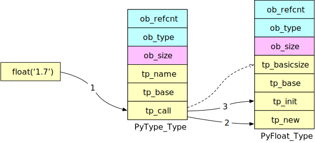

<!--
 * @Author: Hiseh
 * @Date: 2020-08-15 21:43:19
 * @LastEditors: Hiseh
 * @LastEditTime: 2020-09-26 10:15:57
 * @Description: 
-->

# Python对象生命周期

0. [Python对象初探](./pyobject.md)
0. [Python对象的本质](./pyobject2.md)
0. Python对象生命周期

====================================================

上一页我们知道对象的**元数据**保存在`PyTypeObject`实例里，其中就有如何创建和销毁对象的信息，可大胆推测，**实例对象**就是由**类型对象**创建的。这里我们还是以`float`类型为例，看看Python如何创建对象。

## 创建对象

在*Include/floatobject.h*里能看到有两个创建`float`对象的函数，一个是直接用`double`参数创建，一个是从基础类创建，显然第一个应该更简单：

```c
PyAPI_FUNC(PyObject *) PyFloat_FromDouble(double);
PyAPI_FUNC(PyObject *) PyFloat_FromString(PyObject*);
```

`PyFloat_FromDouble`代码如下：

```c
PyObject *PyFloat_FromDouble(double fval) {
    PyFloatObject *op = free_list;

    // 分配内存
    if (op != NULL) {
        // 优先使用空闲的内存缓冲池
        free_list = (PyFloatObject *)Py_TYPE(op);
        numfree--;
    } else {
        // 新申请内存
        op = (PyFloatObject *)PyObject_MALLOC(sizeof(PyFloatObject));
        if (!op) return PyErr_NoMemory();
    }
    
    // 初始化PyObject，重点是初始化引用计数ob_refcnt
    (void)PyObject_INIT(op, &PyFloat_Type);

    // 初始化变量值
    op->ob_fval = fval;
    return (PyObject *)op;
}
```

的确很简单，关键信息就两行，先为`PyFloatObject`分配内存，然后给`ob_fval`赋值。

再看看第二种创建方式，代码比较长，我们只看重点：

```c
#define _Py_NewReference(op) (                          \
    _Py_INC_TPALLOCS(op) _Py_COUNT_ALLOCS_COMMA         \
    _Py_INC_REFTOTAL  _Py_REF_DEBUG_COMMA               \
    Py_REFCNT(op) = 1)
    
PyObject *PyObject_Init(PyObject *op, PyTypeObject *tp) {
    Py_TYPE(op) = tp;
    _Py_NewReference(op);
    return op;
}
```

再看**类型对象**的根类型`PyType_Type`，有个叫`type_call`的变量，其类型是`ternaryfunc`，可以看作一个带条件选择函数指针，如果目标不可被调用，则返回`NULL`。下面看看`type_call`代码重点部分：

```c
static PyObject *type_call(PyTypeObject *type, PyObject *args, PyObject *kwds) {
    PyObject *obj;

    obj = type->tp_new(type, args, kwds);
    obj = _Py_CheckFunctionResult((PyObject *)type, obj, NULL);
    if (obj == NULL) return NULL;

    type = Py_TYPE(obj);
    if (type->tp_init != NULL) {
        int res = type->tp_init(obj, args, kwds);
        if (res < 0) {
            assert(PyErr_Occurred());
            Py_DECREF(obj);
            obj = NULL;
        } else {
            assert(!PyErr_Occurred());
        }
    }
    return obj;
}
```

逻辑也不是很复杂：

0. 首先执行`tp_new`函数，如果没找到，则去`tp_base`指定的父类查找。因为`PyObject`是最终的根，所以总能找到一个可执行的`tp_new`。
0. 在**类型对象中**查找`tp_basicsize`，进而完成申请内存操作。因为`PyType_Type`是虽有类型对象的根，所有总能找到一个可用的`tp_basicsize`来申请内存。
0. 如有必要执行`tp_init`，完成初始化对象工作。

所以我们执行`float('1.7')`时，Python实际创建对象过程如下：



带序号箭头表示了创建实例对象的过程，关键点有三个：

0. 调用其类型对象的`tp_call`函数。
0. 调用`tp_new`函数为实例对象分配内存。
0. 必要时调用`tp_init`函数对实例对象进行初始化。

### 对象行为集

在*Doc/includes/typestruct.h*里，Python定义了对象三种标准方法类型：

```c
PyNumberMethods *tp_as_number;
PySequenceMethods *tp_as_sequence;
PyMappingMethods *tp_as_mapping;
```

我们回头再看*Objects/floatobject.c*：

```c
static PyNumberMethods float_as_number = {
    float_add,          /* nb_add */
    float_sub,          /* nb_subtract */
    float_mul,          /* nb_multiply */
    float_rem,          /* nb_remainder */
    float_divmod,       /* nb_divmod */
    float_pow,          /* nb_power */
    (unaryfunc)float_neg, /* nb_negative */
    float_float,        /* nb_positive */
    (unaryfunc)float_abs, /* nb_absolute */
    (inquiry)float_bool, /* nb_bool */
    // ...
};

PyTypeObject PyFloat_Type = {
    &float_as_number,   /* tp_as_number */
    0,                  /* tp_as_sequence */
    0,                  /* tp_as_mapping */
    // ...
};
```

从`PyFloat_Type`类型对象里能看到，`float`仅支持`PyNumberMethods`操作类型，如果我们想扩展Python内置对象功能，可从此入手。

## 面向对象的特性

我们都知道面向对象有三个关键特性：**封装**，**继承**和**多态**。Python里又如何实现这三个特性能？

### 封装和继承

从源码能看出，Python并没有提供强势的私有类型约束，通常约定俗成用双下划线`__`表示私有函数和变量，但这个并不是强约束，不要指望用此方式真正能隐藏住内部实现。

```py
>>> class Test:
...     def __private_func(self):
...             print('private func')
...
...     def public_func(self):
...             print('public func')
...
>>> t = Test()
>>> t.public_func()
public func
>>>
>>> t.__private_func()
Traceback (most recent call last):
  File "<stdin>", line 1, in <module>
AttributeError: 'Test' object has no attribute '__private_func'
>>>
>>># 很弱的封装方式
>>> t._Test__private_func()
private func
```

继承比较简单了，通过`tp_base`指针即可实现继承。

### 多态

我们看源码，能发现完成`float`初始化后，所有管理对象的场合都不是用`PyFloatObject`，而是通过`PyObject *`指针。所以Python内部函数传递参数都用根类指针，所有需要检查类型的场合，都通过指针所指“对象”的`tp_type`动态判断（俗称Duck Typing）。比如print函数：

```c
PyObject *PyObject_Str(PyObject *v) {
    PyObject *res;
    if (PyErr_CheckSignals()) return NULL;
#ifdef USE_STACKCHECK
    if (PyOS_CheckStack()) {
        PyErr_SetString(PyExc_MemoryError, "stack overflow");
        return NULL;
    }
#endif
    if (v == NULL) return PyUnicode_FromString("<NULL>");
    if (PyUnicode_CheckExact(v)) {
#ifndef Py_DEBUG
        if (PyUnicode_READY(v) < 0) return NULL;
#endif
        Py_INCREF(v);
        return v;
    }
    if (Py_TYPE(v)->tp_str == NULL) return PyObject_Repr(v);

#ifdef Py_DEBUG
    /* PyObject_Str() must not be called with an exception set,
       because it can clear it (directly or indirectly) and so the
       caller loses its exception */
    assert(!PyErr_Occurred());
#endif

    /* It is possible for a type to have a tp_str representation that loops
       infinitely. */
    if (Py_EnterRecursiveCall(" while getting the str of an object"))
        return NULL;
    res = (*Py_TYPE(v)->tp_str)(v);
    Py_LeaveRecursiveCall();
    if (res == NULL) return NULL;
    if (!PyUnicode_Check(res)) {
        PyErr_Format(PyExc_TypeError,
                     "__str__ returned non-string (type %.200s)",
                     Py_TYPE(res)->tp_name);
        Py_DECREF(res);
        return NULL;
    }
#ifndef Py_DEBUG
    if (PyUnicode_READY(res) < 0) return NULL;
#endif
    assert(_PyUnicode_CheckConsistency(res, 1));
    return res;
}

int PyObject_Print(PyObject *op, FILE *fp, int flags) {
    int ret = 0;
    if (PyErr_CheckSignals()) return -1;
#ifdef USE_STACKCHECK
    if (PyOS_CheckStack()) {
        PyErr_SetString(PyExc_MemoryError, "stack overflow");
        return -1;
    }
#endif
    clearerr(fp); /* Clear any previous error condition */
    if (op == NULL) {
        Py_BEGIN_ALLOW_THREADS fprintf(fp, "<nil>");
        Py_END_ALLOW_THREADS
    } else {
        if (op->ob_refcnt <= 0)
            /* XXX(twouters) cast refcount to long until %zd is
               universally available */
            Py_BEGIN_ALLOW_THREADS fprintf(fp, "<refcnt %ld at %p>",
                                           (long)op->ob_refcnt, op);
        Py_END_ALLOW_THREADS else {
            PyObject *s;
            if (flags & Py_PRINT_RAW)
                s = PyObject_Str(op);
            else
                s = PyObject_Repr(op);
            if (s == NULL)
                ret = -1;
            else if (PyBytes_Check(s)) {
                fwrite(PyBytes_AS_STRING(s), 1, PyBytes_GET_SIZE(s), fp);
            } else if (PyUnicode_Check(s)) {
                PyObject *t;
                t = PyUnicode_AsEncodedString(s, "utf-8", "backslashreplace");
                if (t == NULL) {
                    ret = -1;
                } else {
                    fwrite(PyBytes_AS_STRING(t), 1, PyBytes_GET_SIZE(t), fp);
                    Py_DECREF(t);
                }
            } else {
                PyErr_Format(PyExc_TypeError,
                             "str() or repr() returned '%.100s'",
                             s->ob_type->tp_name);
                ret = -1;
            }
            Py_XDECREF(s);
        }
    }
    if (ret == 0) {
        if (ferror(fp)) {
            PyErr_SetFromErrno(PyExc_OSError);
            clearerr(fp);
            ret = -1;
        }
    }
    return ret;
}
```

`PyObject_Str`函数首先通过`ob_type`指针检查对象的类型，然后调用对应类型的`tp_str`函数，并返回给`PyObject_Print`函数打印。根据不同类型调用对应的字符串格式化方式，同一个函数在不同情况下表现了不同的行为，正是多态性的体现。

### 扩展Python
我们用个例子来演示如何扩展Python，例如同样打印函数，我们修改下`Objects/floatobject.c`的`float_repr`函数：

```c
static PyObject *float_repr(PyFloatObject *v) {
    // ...
    //增加条件
    if (PyFloat_AsDouble(v) < -1) {                                  //PyFloat_AsDouble 将PyFloatObject对象转换成C中的double变量
        PyObject *rst = PyUnicode_FromString("Hello Python\n");     //PyUnicode_FromString将字符串转换成unicode（即Python3 的str）对象
        PyObject *out = PySys_GetObject("stdout");                  //根据名称从PyDict_GetItemString里获取内置对象
        if (out != NULL) {
            PyObject_Print(rst, stdout, 0);
        }
    }
    // ...
}
```

然后重新编译Python：

```py
>>> print(1)
1
>>> print(1.1)
1.1
>>> print(-1.1)
Hello Python
-1.1
>>>
```

通过`ob_type`指针， Python在C语言层面实现了对象的**多态**特性，思路跟C++中的虚表指针有异曲同工之妙。如果需要调试Python内部状态，可以用这个技巧。

## 调用对象

当对象被调用时，Python会执行`tp_call`函数函数指针，它会调用`buildin.__import__`，加载真正需要执行的函数。

### 引用计数

看完上一页我们知道每个实例对象都有`ob_refcnt`字段，它记录着当前对象的引用计数，也决定该对象是否会被回收。Python里用*Include/object.h*的`Py_INCREF`和`Py_DECREF`两个宏来加减引用计数。当`ob_refcnt`减为`0`时，`Py_DECREF`会调用类型对象的`tp_dealloc`函数指针来释放内存和系统资源。这里有一点观察者模式的味道，Python用一个函数指针将动态的事件注册动作和类型对象中静态的函数绑定在一起。

> 需要注意的是，类型对象虽然有`ob_refcnt`字段，但除了统一初始化宏，没有其它代码去操作它。可以说类型对象是超越引用计数规则的，实例对象指向类型对象的指针不会增加类型对象的引用，类型对象也永远不会被销毁。可以从代码中看出来：
>
> ```py
> >>> a = 1.7
> >>> sys.getrefcount(float)
> 51
> >>> b = a
> >>> sys.getrefcount(float)
> 51
> >>> c = 1.8
> >>> sys.getrefcount(float)
> 51
> >>> del c
> >>> sys.getrefcount(float)
> 51
> ```
> 
> 另外Python为了保证运行效率，并不会实时申请和释放内存，而是用了个内存池的概念，当调用`tp_dealloc`时只是把内存释放回内存池中。

我们可以在Python里查看实例对象的引用值：

```py
>>> a = 1.7
>>> sys.getrefcount(a)
2
```

等等，怎么引用计数为**2**？我们回想下`PyObject_HEAD_INIT`，对象创建时`ob_refcnt`被设为`1`，然后`getrefcount`返回的计数通常比预期的多一，因为它包括了作为 getrefcount() 参数的这一次（临时）引用。

```py
>>> b = a
>>> sys.getrefcount(a)
3
>>> l = [a]
>>> sys.getrefcount(a)
4
>>> del b
>>> sys.getrefcount(a)
3
```

这里很好理解，每多一次引用，计数都会加一，减一次引用，计数减一。

好了，到目前为止我们初步了解了Python里对象的基础概念，也知道Python如何创建和回收对象，这些知识能帮我们更好地学习Python，但如想更深入学习，还是要看Python官网文档和源码。其实Python源码虽然多，但构造规范，没有用什么奇技淫巧，注释也很长，其实不难阅读。
